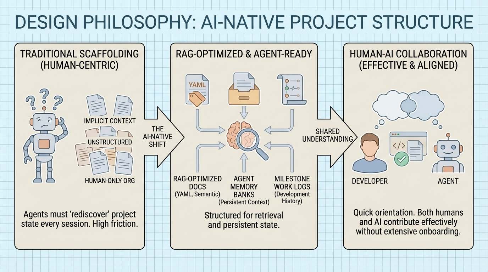

<!--
---
title: "Project Template Repository"
description: "Standardized scaffolding for AI-native, RAG-optimized project repositories"
author: "VintageDon"
date: "2026-01-02"
version: "1.0"
status: "Active"
tags:
  - type: project-root
  - domain: [templates, documentation, devops]
  - tech: [markdown, yaml, python, powershell]
related_documents:
  - "[RadioAstronomy.io Organization](https://github.com/radioastronomyio)"
  - "[Proxmox Astronomy Lab](https://github.com/vintagedon/proxmox-astronomy-lab)"
  - "[NIST AI RMF Cookbook](https://github.com/vintagedon/nist-ai-rmf-cookbook)"
---
-->

# 📋 Project Template Repository


[](https://www.markdownguide.org/)
[](https://greptile.com)
[](LICENSE)

> Standardized scaffolding for AI-native, RAG-optimized project repositories with documentation templates, agent instructions, and milestone-based development structure.

This repository provides the foundational structure for new projects within [RadioAstronomy.io](https://github.com/radioastronomyio). It establishes consistent patterns for documentation, AI agent collaboration, and development workflow — designed to be forked or used as a GitHub template when starting new work.

---

## 🔭 Background

This section explains the design philosophy behind the template. If you're ready to use it, skip to [Quick Start](#-quick-start).



Modern development increasingly involves AI agents as collaborators — code assistants, documentation generators, and autonomous workers. Traditional project scaffolding doesn't account for this reality. Files are organized for humans, context is implicit, and agents must rediscover project state every session.

This template addresses that gap through **RAG-optimized documentation** (YAML frontmatter, semantic structure, controlled vocabulary), **agent memory banks** (persistent context that survives sessions), and **milestone-based work logs** (development history that agents can reference).

The goal is a repository structure where both humans and AI agents can orient quickly, understand project state, and contribute effectively without extensive onboarding.

---

## 🎯 Target Audience

| Audience | Use Case |
|----------|----------|
| Developers | Fork as starting point for new projects |
| AI Agent Operators | Configure agent scaffolding (AGENTS.md, memory bank) |
| Documentation Authors | Use templates for consistent formatting |
| DevOps Engineers | Adopt standard directory structure and tooling configs |

---

## 🏗️ Architecture

The template provides three layers: documentation infrastructure, agent scaffolding, and project structure.

### Documentation Infrastructure

Templates and standards that enable consistent, retrievable documentation.

| Component | Purpose |
|-----------|---------|
| `docs/documentation-standards/` | Template library (READMEs, KB articles, script headers) |
| YAML frontmatter | Enables RAG retrieval and filtering |
| Interior README pattern | Self-documenting directories with navigation links |
| Tagging strategy | Controlled vocabulary for metadata |

### Agent Scaffolding

Files that help AI agents understand and work within the project.

| Component | Purpose |
|-----------|---------|
| `AGENTS.md` | Load order and session pattern for agents |
| `.kilocode/rules/memory-bank/` | Persistent context (brief, product, context, architecture, tech) |
| `.kilocode/rules/` | Code review and commit conventions |
| `.kilocode/workflows/` | Reusable agent workflows |

### Project Structure

Standard directories and files that establish consistent organization.

| Component | Purpose |
|-----------|---------|
| `work-logs/` | Milestone-based development history |
| `shared/` | Cross-project utilities |
| `scratch/` | Temporary working files (gitignored) |
| `staging/` | Pre-commit staging area |
| Standard files | LICENSE, CODE_OF_CONDUCT, CONTRIBUTING, SECURITY |

---

## 📊 Project Status

| Area | Status | Description |
|------|--------|-------------|
| Documentation Templates | ✅ Complete | Primary, interior, KB, worklog templates |
| Script Headers | ✅ Complete | Python, Shell, PowerShell |
| Agent Scaffolding | ✅ Complete | Memory bank, AGENTS.md, rules |
| Tagging Strategy | ✅ Complete | Controlled vocabulary guide |
| Editor Config | ✅ Complete | VSCode, markdownlint, cspell |
| Shared Utilities | 🔄 Growing | Tree generator, more to come |

---

## 📁 Repository Structure

```markdown
project-template-repository/
├── 📂 .ai-sandbox/               # AI experimentation space (gitignored)
├── 📂 .internal-files/           # Reference docs, not for public (gitignored)
├── 📂 .kilocode/                 # Agent configuration
│   ├── rules/
│   │   ├── memory-bank/          # Persistent agent context
│   │   ├── code-review.md        # Code review conventions
│   │   └── commit-conventions.md # Commit message standards
│   └── workflows/                # Reusable agent workflows
├── 📂 .vscode/                   # Editor settings
├── 📂 docs/                      # Documentation
│   └── documentation-standards/  # Template library
├── 📂 scratch/                   # Temporary files (gitignored)
├── 📂 shared/                    # Cross-project utilities
├── 📂 staging/                   # Pre-commit staging
├── 📂 work-logs/                 # Milestone development history
│   ├── 01-ideation-and-setup/
│   └── 02-github-project-frameout/
├── 📄 AGENTS.md                  # Agent load instructions
├── 📄 CODE_OF_CONDUCT.md         # Community standards
├── 📄 CONTRIBUTING.md            # Contribution guidelines
├── 📄 LICENSE                    # MIT License (code)
├── 📄 LICENSE-DATA               # CC-BY-4.0 (data/content)
├── 📄 SECURITY.md                # Security policy
├── 📄 cspell.json                # Spell checker config
└── 📄 .markdownlint.json         # Markdown linter config
```

---

## 📚 Documentation Templates

The template library in `docs/documentation-standards/` provides consistent formatting for all project documentation.

### Document Templates

| Template | Use For |
|----------|---------|
| [primary-readme-template.md](docs/documentation-standards/primary-readme-template.md) | Repository root README |
| [interior-readme-template.md](docs/documentation-standards/interior-readme-template.md) | Directory READMEs |
| [general-kb-template.md](docs/documentation-standards/general-kb-template.md) | Standalone documents (guides, specs) |
| [worklog-readme-template.md](docs/documentation-standards/worklog-readme-template.md) | Work-log milestone directories |

### Script Headers

| Template | Use For |
|----------|---------|
| [script-header-python.md](docs/documentation-standards/script-header-python.md) | All `.py` files |
| [script-header-shell.md](docs/documentation-standards/script-header-shell.md) | All `.sh` files |
| [script-header-powershell.md](docs/documentation-standards/script-header-powershell.md) | All `.ps1` files |

### Guidelines

| Document | Use For |
|----------|---------|
| [tagging-strategy.md](docs/documentation-standards/tagging-strategy.md) | Building YAML frontmatter vocabulary |
| [code-commenting-dual-audience.md](docs/documentation-standards/code-commenting-dual-audience.md) | Writing for humans and AI |

---

## 🤖 Agent Configuration

The `.kilocode/` directory provides structure for AI agent collaboration.

### Memory Bank

Persistent context files that agents load at session start:

| File | Update Frequency | Content |
|------|------------------|---------|
| `brief.md` | Rarely | Project identity and purpose |
| `product.md` | When goals evolve | Why the project exists |
| `context.md` | Every session | Current state and recent changes |
| `architecture.md` | When structure changes | How it's organized |
| `tech.md` | When stack changes | Technologies and constraints |
| `tasks.md` | As needed | Repetitive workflows |

### Session Pattern

1. Load memory bank files in order (brief → product → context → architecture → tech)
2. Confirm context loaded
3. Do work
4. Update `context.md` before session ends
5. Update other files if relevant changes occurred

---

## 🤝 OSS Program Support

This repository benefits from open source programs that provide tooling to qualifying public repositories.

### Active Programs

| Program | Provides | Use Case |
|---------|----------|----------|
| [Greptile](https://greptile.com) | AI code review | PR review, sprint summaries, Macroscope analytics |
| [Atlassian](https://www.atlassian.com/software/views/open-source-license-request) | Jira, Confluence (Standard) | Project tracking, documentation |

### Available for Future Use

| Program | Provides | Planned Use |
|---------|----------|-------------|
| [Snyk](https://snyk.io/plans/) | Security scanning | Dependency vulnerability detection |
| [SonarCloud](https://www.sonarsource.com/open-source-editions/) | Code quality | Static analysis |
| [Sentry](https://sentry.io/for/open-source/) | Error tracking | Runtime monitoring |
| [Datadog](https://www.datadoghq.com/partner/open-source/) | Observability | Metrics, logs, APM |

---

## 🌟 Open Science Philosophy

We practice open science and open methodology — our version of "showing your work":

- **Research methodologies** are fully documented and repeatable
- **Infrastructure configurations** are version-controlled and automated
- **Scripts and pipelines** are published so others can learn, adapt, or improve them
- **Learning processes** are captured and shared for community benefit

All projects operate under open source licenses (primarily MIT) to ensure maximum reproducibility.

---

## 🚀 Quick Start

### Using as GitHub Template

1. Click "Use this template" on GitHub
2. Name your new repository
3. Clone locally
4. Run initial setup:

```bash
# Update frontmatter dates
find . -name "*.md" -exec sed -i 's/YYYY-MM-DD/2026-01-02/g' {} \;

# Update author references
find . -name "*.md" -exec sed -i 's/\[Author\]/YourName/g' {} \;

# Initialize memory bank
cp .kilocode/rules/memory-bank/brief.md.example .kilocode/rules/memory-bank/brief.md
# Edit brief.md with your project details
```

### Forking for Customization

1. Fork repository
2. Modify templates for your organization's standards
3. Update tagging vocabulary in `docs/documentation-standards/tagging-strategy.md`
4. Adjust agent configuration in `.kilocode/`

### Template Selection

```
Is it the repository root README?
├─ Yes → primary-readme-template.md
└─ No: Is it a directory README?
        ├─ Yes: Is it a work-logs milestone?
        │       ├─ Yes → worklog-readme-template.md
        │       └─ No  → interior-readme-template.md
        └─ No: Is it a standalone document?
                └─ Yes → general-kb-template.md
```

---

## 📄 License

- **Code**: [MIT License](LICENSE)
- **Data/Content**: [CC-BY-4.0](LICENSE-DATA)

---

## 🙏 Acknowledgments

- [Kilocode](https://kilocode.ai/) — Agent scaffolding patterns
- [Markdownlint](https://github.com/DavidAnson/markdownlint) — Markdown consistency
- Open source community — Tools and libraries that make this possible

---

Last Updated: January 2, 2026 | Status: Active